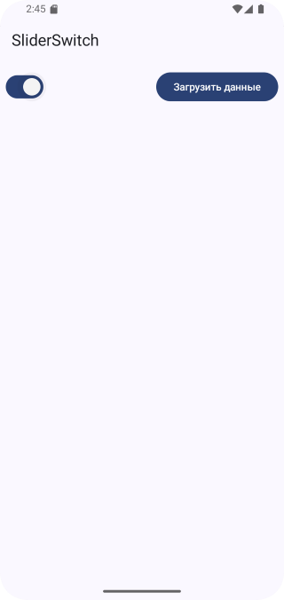

# Домашнее задание по теме "SliderSwitch"

## Приложение «Загрузка данных»

На основе пройденного материала необходимо написать приложение для вывода загруженных данных на экран устройства. В качестве данных может быть рассказ любого автора, список пользователей базы данных и прочее.
При нажатии кнопки «Загрузка данных» появляется всплывающее сообщение «Нет доступа». Кнопка находится в неактивном состоянии.
В случае переключения `Switch` в отмеченное положение, кнопка становится в активном состоянии и при нажатии на кнопку «Загрузка данных» на экране устройства появляются загруженные данные и всплывающее сообщение символизирует о начале загрузки данных.

## Скриншоты домашнего задания

Скриншоты здесь

